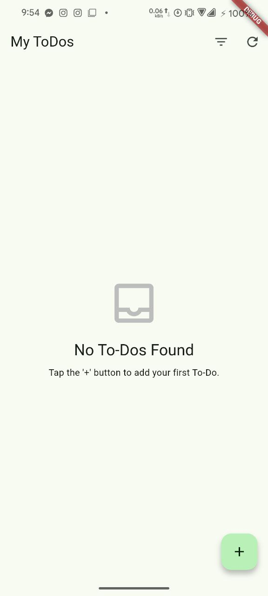
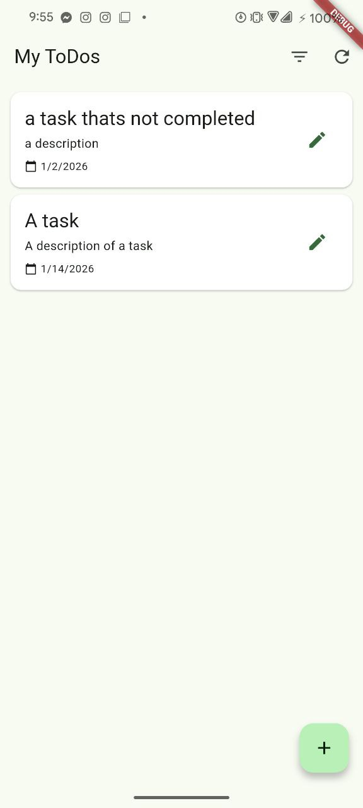
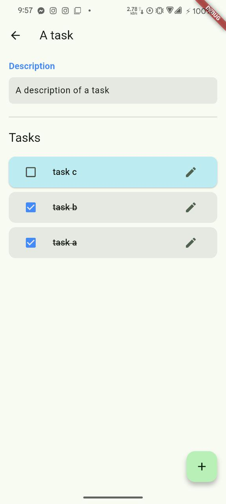

# Todo List


A comprehensive task management application built with Flutter, designed to help users organize their daily activities efficiently. This application leverages the **BLoC (Business Logic Component)** pattern for state management and uses local storage for data persistence.

## Description

This Todo List app provides a robust platform for managing tasks. Users can create tasks with titles, descriptions, and dates. The app ensures that data is persisted locally, allowing users to access their tasks even when offline. It features a clean, responsive UI that makes task management intuitive.

## Screenshots

| Task List | Add Task | Task Details |
|:---:|:---:|:---:|
|  |  |  |

## Features

-   **Create Tasks**: Add detailed tasks with a title, description, and due date.
-   **Read Tasks**: View all tasks in a clean, organized list.
-   **Update Tasks**: Modify existing tasks to correct details or update status.
-   **Delete Tasks**: Remove tasks that are no longer needed.
-   **Task Completion**: Mark tasks as done/undone with a simple checkbox.
-   **Local Persistence**: All data is saved locally using **Hive/Sqflite** (depending on implementation specifics), ensuring data privacy and offline access.
-   **State Management**: efficient state management using **flutter_bloc**.

## Tech Stack

-   **Framework**: [Flutter](https://flutter.dev/)
-   **Language**: [Dart](https://dart.dev/)
-   **State Management**: [flutter_bloc](https://pub.dev/packages/flutter_bloc)
-   **Local Storage**: [sqflite](https://pub.dev/packages/sqflite) / [hive](https://pub.dev/packages/hive)
-   **Utilities**: 
    -   [intl](https://pub.dev/packages/intl) - For date formatting.
    -   [uuid](https://pub.dev/packages/uuid) - For generating unique IDs.
    -   [path_provider](https://pub.dev/packages/path_provider) - For filesystem access.

## Installation

Follow these steps to set up the project locally:

1.  **Clone the repository:**
    ```bash
    git clone https://github.com/MahirUddinn/todo_list.git
    ```

2.  **Navigate to the project directory:**
    ```bash
    cd todo_list
    ```

3.  **Install dependencies:**
    ```bash
    flutter pub get
    ```

4.  **Run the app:**
    ```bash
    flutter run
    ```

## Contributing

Contributions are welcome! If you have any suggestions or improvement, please create a pull request or open an issue.

## License

This project is licensed under the MIT License - see the LICENSE file for details.
